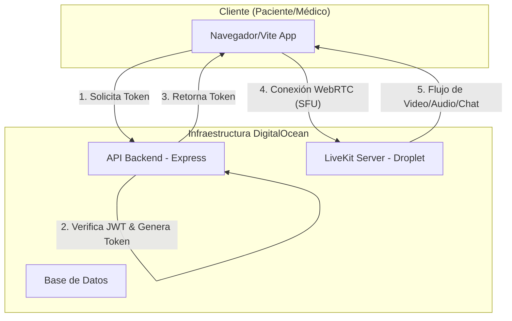

# Evaluación Técnica: Integración de LiveKit en MediCampo

## Resumen Ejecutivo
Para superar las limitaciones actuales de latencia y estabilidad en las videollamadas (WebRTC P2P/PeerJS), se propone la implementación de **LiveKit**. Esta solución utiliza una arquitectura **SFU (Selective Forwarding Unit)**, lo que garantiza conexiones robustas, escalabilidad y funcionalidades avanzadas como chat de texto integrado y grabación.

---

## 1. Justificación de LiveKit
*   **WebRTC Interno Moderno**: A diferencia de PeerJS (P2P), LiveKit maneja la lógica de red en el servidor, reduciendo la carga en los dispositivos de los pacientes.
*   **Self-Hostable**: Control total sobre la infraestructura y privacidad de los datos médicos.
*   **SDK de Alto Nivel**: Posee componentes oficiales para React/Next.js que aceleran el desarrollo.
*   **Chat Incluido**: Permite enviar mensajes de texto y datos (recetas, links) a través del mismo canal de datos de la llamada.

---

## 2. Arquitectura de Infraestructura Propuesta

Para proteger el rendimiento de la aplicación principal y aprovechar el **GitHub Student Developer Pack**, seguiremos esta estructura:

### A. Nodo de Aplicación (Existente - DigitalOcean App Platform / Droplet)
*   **Frontend**: React (Vite).
*   **Backend**: Node.js (Express) - *Encargado de generar los Access Tokens de LiveKit*.
*   **Base de Datos**: PostgreSQL (DigitalOcean Managed DB).

### B. Nodo LiveKit (Nuevo - Droplet Dedicado)
*   **Servidor**: LiveKit Server (instalado vía Docker o script oficial).
*   **Ubicación**: Un Droplet independiente de DigitalOcean (mínimo 2GB RAM / 1 vCPU).
*   **Razón**: El tráfico de audio/video es intensivo en CPU y ancho de banda. Separarlo evita que la API de MediCampo se bloquee durante consultas.

---

## 3. Plan de Implementación por Fases

### Fase 1: Infraestructura (DevOps)
1.  **Creación de Rama**: `feature/livekit-integration` para no afectar `main`.
2.  **Despliegue de LiveKit**:
    *   Configurar un subdominio (ej: `livekit.medicampo.com`).
    *   Generar llaves `API_KEY` y `API_SECRET`.
    *   Abrir puertos en el Firewall de DigitalOcean (TCP: 7880, 443 | UDP: 50000-60000).

### Fase 2: Backend (Generación de Tokens)
1.  Instalar `livekit-server-sdk` en el backend actual.
2.  Crear un nuevo endpoint `GET /api/livekit/token` que:
    *   Valide el JWT del usuario (ya implementado).
    *   Genere un `AccessToken` con permisos para un `roomName` (ID de la cita).
    *   Retorne el token al frontend.

### Fase 3: Frontend (Componente de Llamada)
1.  Instalar `livekit-client` y `@livekit/components-react`.
2.  Reemplazar el componente actual de videollamada por el `LiveKitRoom`.
3.  Implementar:
    *   Control de cámara/micro.
    *   Vista de participante remoto (Médico/Paciente).
    *   Chat de texto lateral usando el Data Channel de LiveKit.

---

## 4. Estabilidad y Costos (GitHub Student Pack)
*   **DigitalOcean Credits**: El Student Pack otorga hasta $200 en créditos. Esto cubre perfectamente un Droplet de $12-24/mes para LiveKit durante varios meses.
*   **Escalabilidad**: Si el tráfico aumenta, LiveKit permite balanceo de carga (Egress/Ingress), pero para la fase actual, un solo nodo es suficiente.

---

## 5. Próximos Pasos Recomendados
1.  **Validar dominio**: Necesitamos un dominio con SSL para que WebRTC funcione correctamente en producción.
2.  **Preparar entorno Docker**: LiveKit corre mejor en contenedores para facilitar actualizaciones.

---
**Nota**: Este documento es una evaluación técnica inicial. No se han realizado cambios en el código aún.
